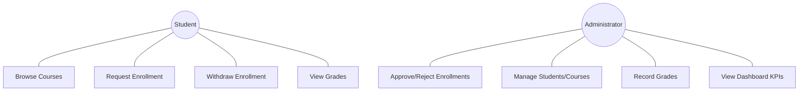
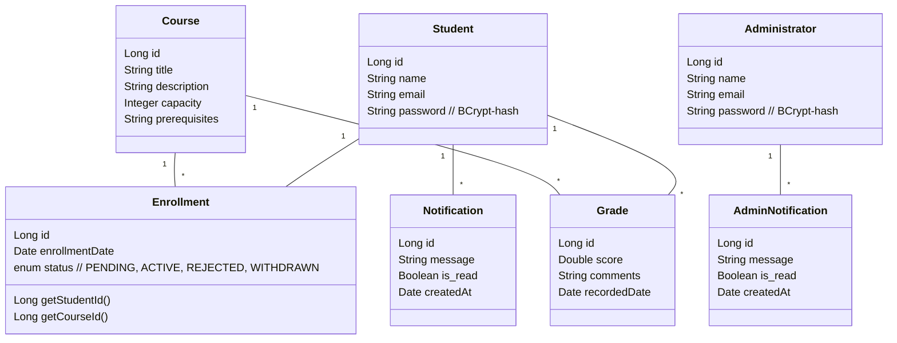
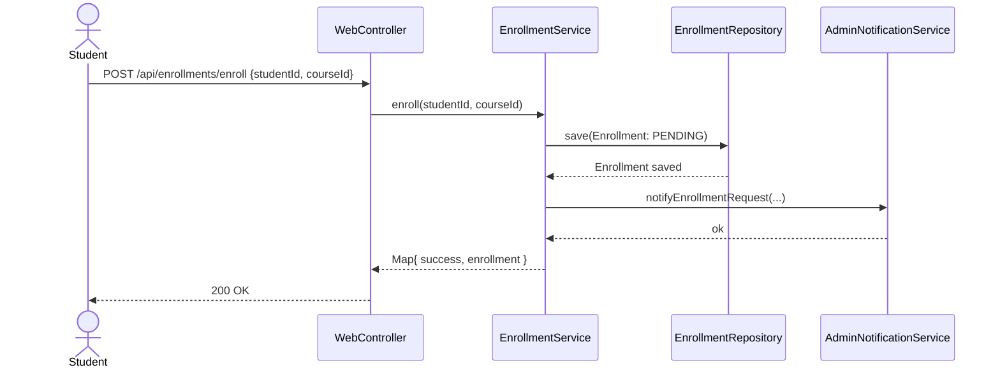
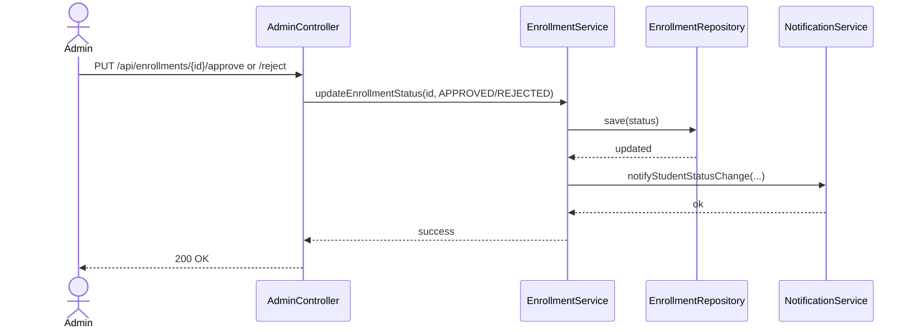
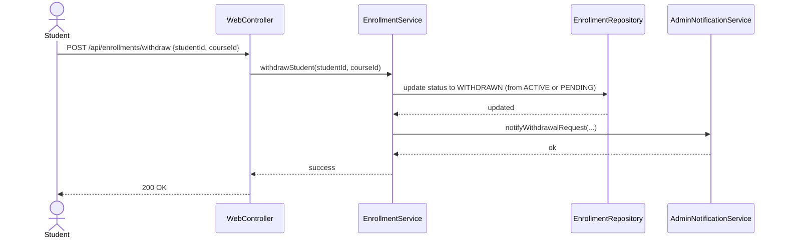

## Student Course Management System — Project Report

Version: 1.0.0  
Date: 2025-08-18
By: Mohamed Mahmoud Hussein Ahmed Raslan
Student ID: 19P7975

### 1) Project Description
The Student Course Management System (SCMS) is a Spring Boot web application that streamlines university operations across two role-based portals:
- Student portal: course discovery, enrollment/withdrawal, enrollment status tracking, grade viewing, and notifications.
- Administrator portal: management of students and courses, enrollment approvals/rejections, grade recording, admin notifications, and KPIs via dashboard cards.

The system follows a service-oriented design with clear bounded contexts (Student, Course, Enrollment, Grade, Notification, AdminNotification, Administrator). Cross-cutting concerns are implemented with Aspect-Oriented Programming (AOP) for logging, performance monitoring, transaction boundaries, and exception visibility. Persistence uses MySQL via Spring Data JPA. Views are rendered with Thymeleaf and enhanced with lightweight JavaScript for AJAX interactions. Swagger (OpenAPI) documents REST endpoints.

Key capabilities:
- Authentication for students and administrators (BCrypt passwords).
- Course catalog + enrollment lifecycle (request → admin decision → notifications).
- Student self-service withdrawal (ACTIVE and PENDING).
- Grade recording by admins; student grade visibility.
- Admin dashboards with live statistics (students, enrollments, GPA, active students).
- Notifications for students on status changes; admin notifications on student actions.
- Discoverable REST APIs via Swagger UI.

---

### 2) Viewpoints and Requirements
- Student viewpoint
  - Goals: find courses, enroll/withdraw, track status, view grades, receive timely updates.
  - Concerns: clarity of status and actions; data privacy; responsive UI.
- Administrator viewpoint
  - Goals: manage courses/students, approve/reject enrollments, record grades, monitor KPIs, receive operational notifications.
  - Concerns: accuracy, traceability, performance for lists and actions, secure admin-only flows.
- System/Operations viewpoint
  - Goals: reliable persistence (MySQL), observability (logs), portable builds (Docker), profile-based config.
  - Concerns: secure secrets, schema evolution safety, performance under load.
- Security viewpoint
  - Goals: protect credentials, enforce role-based access, minimize JSON exposure.
  - Concerns: password hashing, session handling, endpoint protection.

---

### 3) Functional Requirements
- Student can register/login and access only own information.
- Browse courses; request enrollment; withdraw from ACTIVE/PENDING enrollments.
- Administrator can approve/reject enrollment requests.
- Student receives notification on admin status changes.
- Admin receives admin-notifications for student-triggered events (e.g., withdrawal).
- Admin can manage students and courses (CRUD).
- Admin can record grades; students can view grades.
- Dashboard shows statistics: total students, total enrollments, average GPA, active students.
- REST endpoints are documented and testable via Swagger UI.

### 4) Non-Functional Requirements
- Security: BCrypt password hashing; role-protected actions; avoid circular JSON exposure.
- Performance: HikariCP connection pooling; AOP performance metrics.
- Reliability: durable MySQL storage; controlled `ddl-auto` lifecycle (dev: update; prod: validate).
- Maintainability: SOA service boundaries; AOP for cross-cutting; unit tests with JUnit/Mockito.
- Observability: structured logs around service calls and timings; error logging.
- Portability: Docker multi-stage build; profile-based configs; environment variables for secrets.
- Usability: clear status badges; safe actions (confirm dialogs); consistent navigation and feedback.

---

### 5) Tech Stack
- Backend: Spring Boot 3.5.4, Spring Web, Spring Data JPA (Hibernate 6.x), Spring Security, Springdoc OpenAPI, HikariCP
- View layer: Thymeleaf templates + vanilla JS (AJAX)
- Database: MySQL 8.x (dev/prod). H2 was used only early in development
- Build/Runtime: Java 17+, Maven
- Testing: JUnit 5, Mockito, Spring Boot Test, MockMvc
- Containerization: Docker (multi-stage build)
- Config: `application.properties`, `application-dev.properties`, `application-prod.properties`

Why this stack:
- Spring Boot: opinionated defaults, quick setup, production-ready.
- JPA/Hibernate: reduces boilerplate, robust ORM with proven ecosystem.
- MySQL: mature RDBMS for consistency and durability.
- Spring Security + BCrypt: secure authentication/authorization.
- Thymeleaf: tight MVC integration, simple server-side rendering.
- Springdoc OpenAPI: frictionless interactive documentation.
- HikariCP: fast, resilient connection pooling.
- Docker: reproducible builds and runtime parity.

---

### 6) Architecture Overview (SOA + AOP)
- Layers: Controller (REST + MVC) → Service (business rules) → Repository (JPA) → Entity (JPA model).
- Services (bounded contexts): Student, Course, Enrollment, Grade, Notification, AdminNotification, Administrator.
- Cross-cutting via AOP in `com.scms.aspect`:
  - LoggingAspect: before/after/throwing logs for service calls.
  - PerformanceMonitoringAspect: `@Around` advice to time service executions.
  - SecurityAspect: intended boundary checks (commented to avoid clashes with custom auth), ready for enforcement.
  - TransactionManagementAspect: transactional boundaries complementing `@Transactional` usage.
  - ExceptionHandlingAspect: centralized error visibility.

---

### 7) Aspects and Aspect Types
- LoggingAspect (`src/main/java/com/scms/aspect/LoggingAspect.java`)
  - Advice: `@Before`, `@AfterReturning`, `@AfterThrowing`; Pointcut: `execution(* com.scms.service.*.*(..))`
  - Purpose: operation traceability and error diagnostics.
- PerformanceMonitoringAspect (`src/main/java/com/scms/aspect/PerformanceMonitoringAspect.java`)
  - Advice: `@Around`; Scope: service layer; warns if method > 1000 ms.
- SecurityAspect (`src/main/java/com/scms/aspect/SecurityAspect.java`)
  - Advice: intended `@Before` on controllers/admin services; currently commented to avoid interfering with custom auth.
- TransactionManagementAspect (`src/main/java/com/scms/aspect/TransactionManagementAspect.java`)
  - Purpose: ensure atomic writes and consistency where needed (alongside `@Transactional`).
- ExceptionHandlingAspect (`src/main/java/com/scms/aspect/ExceptionHandlingAspect.java`)
  - Purpose: consistent logging/normalization for error analysis.

How/where applied: Pointcuts target `com.scms.service..*` so controllers remain thin and cross-cutting is centralized.

---

### 8) Services and Service Types
- Domain (non-agnostic) services:
  - `StudentService`, `CourseService`, `EnrollmentService`, `GradeService`, `AdministratorService`, `AdminNotificationService`.
- Cross-domain/relatively agnostic within the app:
  - `NotificationService` (student-facing notifications; can be generalized further).

Microservice candidates:
- Enrollment Service: clear workflow/state machine with notifications.
- Notification Service: event-driven fan-out (future: email/SMS/push).
- Course Catalog Service: read-heavy and cacheable.
- Identity/Auth Service: central credentials/roles.
- Grades Service: well-bounded with clear CRUD + policies.

---

### 9) Core and Crosscutting Requirements
- Core: auth, course browse, enroll/withdraw, admin approvals, grades, notifications, dashboards, documented APIs.
- Crosscutting: logging, performance, transactions, exception visibility, security, config profiles, observability.

---

### 10) Use Cases
- Student registers/logs in.
- Student browses courses and requests enrollment.
- Student withdraws from ACTIVE/PENDING enrollments.
- Admin views pending enrollments and approves/rejects.
- Admin manages students/courses; records grades.
- Student views grades; both parties receive notifications.

Use Case Diagram (Mermaid):


---

### 11) Classes and Class Diagram
Primary entities: `Student`, `Course`, `Enrollment`, `Grade`, `Notification`, `AdminNotification`, `Administrator`.

Class Diagram (Mermaid):


---

### 12) Sequence Diagrams
Enrollment request (student):


Admin approval/rejection:


Withdrawal (student):


---

### 13) Implementation Challenges and Resolutions
- MySQL migration and reserved keywords
  - Renamed `read` → `is_read` in `Notification`/`AdminNotification` to avoid conflicts.
  - Bootstrapped schema with `ddl-auto=create` once, then reverted to `update`.
- JSON serialization loops and HTTP 415 in tests
  - Replaced `@JsonManagedReference` with `@JsonIgnore` on `Course.enrollments/grades`.
  - Added `Enrollment.getStudentId()/getCourseId()` to support FE and tests.
- Authentication bugs (plaintext compares)
  - Fixed via `passwordEncoder.matches()` in `StudentService` and `AdministratorService`.
- UI consistency (stats cards, withdraw visibility, enrolled badges)
  - Corrected `WebController` aggregations and Thymeleaf conditions (include PENDING).
- Notifications temporarily disabled during DB migration
  - Re-enabled unread counts and student/admin notification queries after schema stabilization.
- Port conflicts and stale classes
  - Killed old processes on 8080; used `mvn clean` to rebuild.

---

### 14) Future Improvements
- Migrations with Flyway/Liquibase (replace `ddl-auto`).
- Asynchronous, event-driven notifications (email/SMS/push channels).
- Caching for course catalog and dashboard metrics.
- Audit logging and admin activity trails.
- Fine-grained RBAC and method-level security annotations.
- Pagination/filtering across admin lists; full-text search.
- CI/CD with coverage and quality gates; staging environment.

---

### 15) How to Use (Local Development)
Prerequisites: Java 17+, MySQL 8+, Maven; ensure port 8080 is free.

1. Configure DB in `src/main/resources/application-dev.properties` (already set to use MySQL):
   - URL: `jdbc:mysql://localhost:3306/scms_db_dev?createDatabaseIfNotExist=true&useSSL=false&serverTimezone=UTC&allowPublicKeyRetrieval=true`
   - Username: `scms_user`
   - Password: `scms_password`
2. Run: `mvn spring-boot:run -Dspring.profiles.active=dev`
3. Access:
   - Web app: `http://localhost:8080`
   - Swagger UI: `http://localhost:8080/swagger-ui.html`

If port is busy, terminate existing Java/Tomcat processes or set another `server.port`.

---

### 16) Credentials for Testing
- Admin: If no admin exists, create via API:
```bash
curl -X POST http://localhost:8080/api/admin/register \
  -H "Content-Type: application/json" \
  -d '{"name":"Admin","email":"admin@scms.edu","password":"Admin123!"}'
```
- Student: create via API (or via UI, if enabled):
```bash
curl -X POST http://localhost:8080/api/students/register \
  -H "Content-Type: application/json" \
  -d '{"name":"Student One","email":"student1@scms.edu","password":"Student123!"}'
```

---

### 17) Links to Test Services (Selected Endpoints)
- Students
  - POST `/api/students/register`
  - POST `/api/students/login`
  - GET `/api/students/{id}`
- Courses
  - GET `/api/courses`
  - POST `/api/courses` (admin)
  - PUT `/api/courses/{id}` (admin)
  - DELETE `/api/courses/{id}` (admin)
- Enrollments
  - POST `/api/enrollments/enroll` body: `{ "studentId":1, "courseId":1 }`
  - POST `/api/enrollments/withdraw` body: `{ "studentId":1, "courseId":1 }`
  - PUT `/api/enrollments/{id}/approve` (admin)
  - PUT `/api/enrollments/{id}/reject` (admin)
- Grades
  - POST `/api/grades` (admin)
  - GET `/api/grades/student/{studentId}`
- Notifications
  - GET `/api/notifications/student/{studentId}`
  - GET `/api/notifications/student/{studentId}/unread-count`
  - GET `/api/admin-notifications` (admin)

Swagger/OpenAPI:
- Swagger UI: `http://localhost:8080/swagger-ui.html`
- OpenAPI JSON: `http://localhost:8080/api-docs`

---

### 18) Steps of Implementation (High-Level)
1. Initialize Spring Boot project, define core entities, repositories, services, and controllers.
2. Implement authentication for Student and Administrator with BCrypt.
3. Build enrollment workflow and notifications (student/admin).
4. Add grade management and admin dashboards/statistics.
5. Introduce AOP: logging, performance; secure serialization adjustments (`@JsonIgnore`).
6. Migrate from H2 to MySQL; handle reserved keywords; stabilize schema.
7. Write and stabilize unit/integration tests (MockMvc). Fix failing tests.
8. Improve UI/UX: withdraw buttons, enrolled status badges, logout nav, cards with real data.
9. Add Docker multi-stage build and Swagger docs.

---

### 19) How, Why, and Where Each Aspect and Service Was Implemented
- LoggingAspect
  - Where: `src/main/java/com/scms/aspect/LoggingAspect.java`
  - Why: global visibility of service calls and errors.
  - How: `@Before`, `@AfterReturning`, `@AfterThrowing` around service pointcuts.
- PerformanceMonitoringAspect
  - Where: `src/main/java/com/scms/aspect/PerformanceMonitoringAspect.java`
  - Why: baseline and detect slow operations (>1000ms warning).
  - How: `@Around` advice capturing execution time.
- SecurityAspect
  - Where: `src/main/java/com/scms/aspect/SecurityAspect.java`
  - Why: optional request-level guards without polluting business logic.
  - How: prepared pointcuts; currently commented to avoid clashing with custom auth flow.
- TransactionManagementAspect / `@Transactional`
  - Where: service methods performing writes (enroll, withdraw, approve/reject, grade).
  - Why: atomicity and consistency on DB mutations.
- ExceptionHandlingAspect
  - Where: service boundary; Why: unified error logs for faster RCA.

Services (`src/main/java/com/scms/service/*.java`):
- StudentService, CourseService, EnrollmentService, GradeService, AdministratorService, NotificationService, AdminNotificationService
- Why: clean separation of concerns, easier testing; boundaries align with microservice seams.
- How: controllers remain thin; services coordinate repositories and encapsulate business rules.

---

### 20) Screenshots


